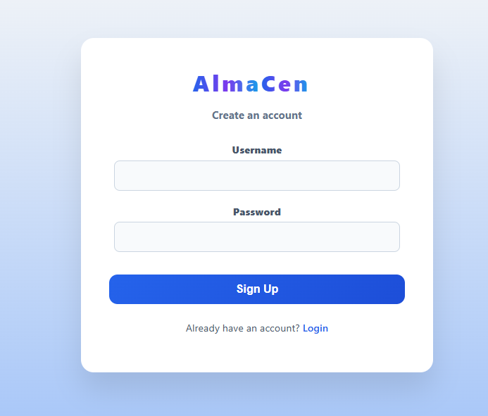
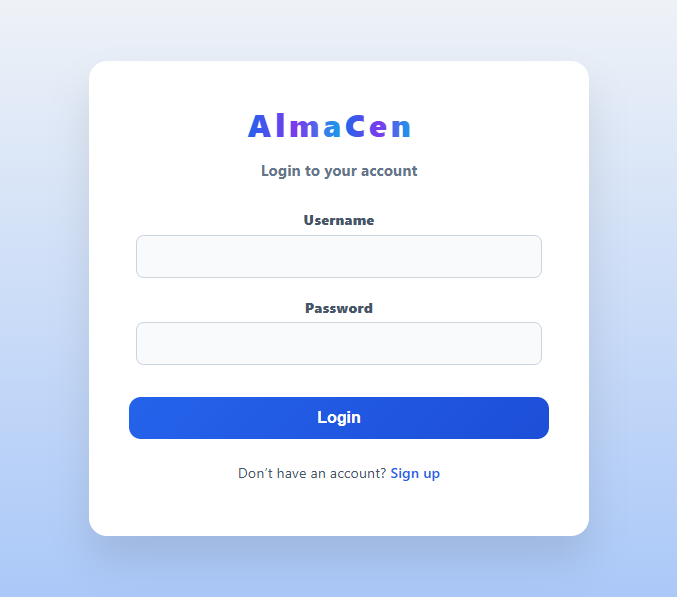
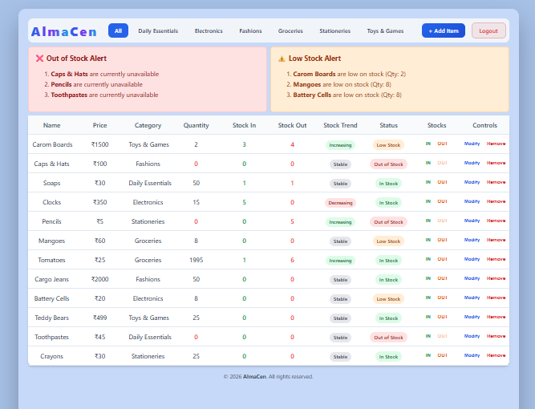
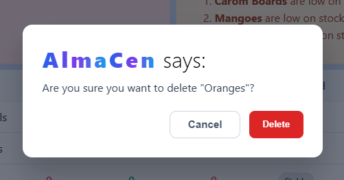
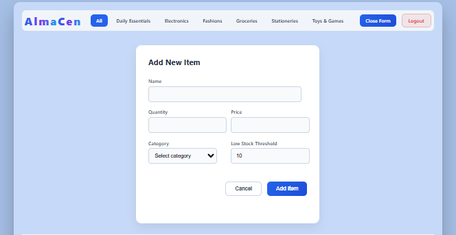
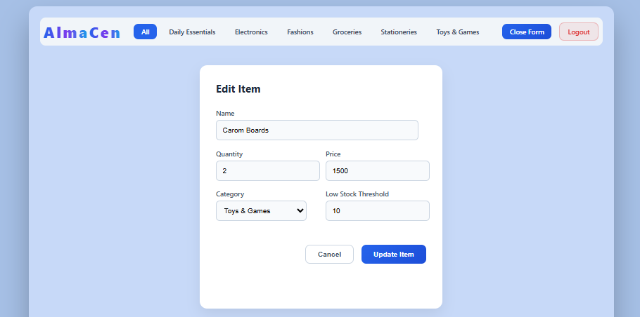
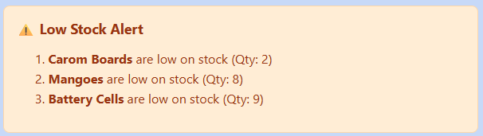
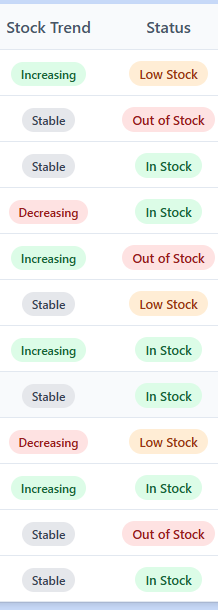

📦 AlmaCen – Inventory Management System 

👩‍💻 Author 
Sharanya Aithal KS 

📌 Overview 

AlmaCen is a Web-Based Inventory Management System designed to simplify stock management and improve operational efficiency. 
The system provides a centralized platform where users can manage inventory items, track stock movements, and monitor real-time stock status effectively. 
Built using the MERN Stack, AlmaCen demonstrates a modern, scalable, and secure approach to inventory control, eliminating manual errors and improving decision- making through automation and real-time updates.

🎯 Objectives 

-> Develop a web-based inventory management system 
-> Implement secure authentication and authorization (JWT) 
-> Provide centralized inventory control (Add, Edit, Delete items) 
-> Track stock inflow and outflow efficiently 
-> Display stock status (In Stock, Low Stock, Out of Stock) 
-> Implement full CRUD operations using MERN stack 
-> Ensure efficient database management using MongoDB 
-> Build a scalable and modular full-stack application 
-> Enhance user experience with responsive UI and real-time updates 

🛠️ Technologies Used 

-> JavaScript – Core programming language 
-> React.js – Frontend UI development 
-> Node.js – Backend runtime environment 
-> Express.js – REST API development 
-> MongoDB – NoSQL database 
-> Mongoose – Database modeling 
-> Axios – API communication 
-> JWT (JSON Web Token) – Authentication & security 
-> Socket.io – Real-time updates 
-> HTML5, CSS3, Bootstrap – Responsive UI design 
-> npm – Package management 

⚙️ System Workflow 

-> User registers / logs in securely 
-> Access dashboard with inventory overview 
-> Add / update / delete inventory items 
-> Track stock inflow and outflow 
-> System updates stock status automatically 
-> Real-time updates using Socket.io 
-> View stock alerts and trends 

📦 Project Structure 
AlmaCen/ 
│── backend/ 
│   ├── models/ 
│   ├── routes/ 
│   ├── controllers/ 
│   └── server.js 
│── frontend/ 
│   ├── components/ 
│   ├── pages/ 
│   └── App.js 
│── config/ 
│── public/ 
│── package.json 
│── README.md 
│── LICENSE 
⚙️ Setup Instructions 

Clone the repository 

git clone https://github.com/your-username/AlmaCen.git 
cd AlmaCen 

💡 Features 

-> Centralized inventory management 
-> Secure authentication (JWT) 
-> Real-time stock updates 
-> Stock status indicators 
-> Responsive UI dashboard 
-> Trend analysis system 

🖥️ User Interfaces 

-> Sign-Up – Create new account 
-> Log-In – Access existing account 
-> Dashboard – View stock overview 
-> Add Items – Add new inventory 
-> Update Items – Modify existing items 
-> Delete Items – Remove items 
-> Stock Alerts – Low/Out of stock alerts 
-> Stock Trends – Track stock changes 

🚀 Future Enhancements 

-> Multi-role access (Admin, Staff, Manager 
-> Graphical dashboards (charts & analytics) 
-> Barcode/QR code integration 
-> Advanced reporting (PDF/Excel export) 
-> Multi-warehouse support 
-> AI-based stock prediction 

📜 License 

This project is licensed under the MIT License. 

⭐ Final Note 

AlmaCen demonstrates how the MERN stack can be effectively used to build a secure, scalable, and efficient inventory management system.
The project highlights strong full-stack development skills and provides a practical solution for real-world stock management challenges with real-time capabilities and modern architecture.

📸 Screenshots

## 📸 Screenshots

